# Glam Dolls

# About
Glam Dolls is a business website that advertises the Glam Dolls beauty salon. On this website, you can view all the different treatments offered by the salon, list through the different categories of these treatments, and even buy gift cards!
You also have the ability to subscribe for the newest news on offers or discounts.

[Live Website](https://glam-dolls.herokuapp.com/)

## Table of Contents
  - [Business Goals](#business-goals)
  - [User goals](#User-goals)
  - [Features](#features)
  - [Technologies Used](#technologies-used)
  - [Framewoks](#frameworks)
  - [Testing](#testing)
  - [Deployment](#deployment)
  - [Acknowledgement](#acknowledgement)

## Business Goals
  - To target the customers who are looking for a beauty salon.
  - To target the customers who are looking for nails treatments.
  - To target the customers who are looking for facial treatments.
  - To target the customers who are looking for eye treatments.
  - To sell online how many gift cards is possible.

## User goals

As a customer,  I would like
  - To know what treatments this beauty salon offer.
  - To be able to select a specific category of treatments.
  - To be able to see the description and price of treatment.
  - To be able to buy a gift card online for someone special.
  - To be able to see the total in my shopping bag before checkout.

## User Stores

 - ### Registration and User Account
    - As **Site User** I want to be able to **easily register for an account** so that I can **have a personal account and be able to view my profile**
    - As **Site User** I want to be able to **easily login or logout** so that I can **access my personal account information**
    - As **Site User** I want to be able to **easily recover my password in case I forget it** so that I can **recovery access to my account**
    - As **Site User** I want to be able to **receive an email confirmation after registering** so that I can **verify that my account registration was successful**

 - ## Viewing and Navigation
    - As **User** I want to be able to **view the type of vouchers** so that I can **select one to purchase**
    - As **User** I want to be able to **view individual procedure details** so that I can **identify the price, description and time**
    - As **User** I want to be able to **view a specific category of procedure** so that I can **quickly find in what I am interested in**
    - As **User** I want to be able to **subscribe** so that  I can **receive the offers by email**

  - ## Purchasing and Checkout
    - As **Shopper** I want to be able to **easily select the type of the voucher** so that I can **ensure I don't accidentally select the wrong one**
    - As **Shopper** I want to be able to **view items in my bag to be purchased** so that I can **identify the total cost of my purchase**
    - As **Shopper** I want to be able to **adjust the quantity of individual items in my bag** so that I can **easily make changes to my purchase before checkout**
    - As **Shopper** I want to be able to **easily enter my payment information** so that I can **check out quickly and no hassles**
    - As **Shopper** I want to be able to **feel my personal and payment information is safe and secure** so that I can **confidently provide needed information to make a purchase**
    - As **Shopper** I want to be able to **view an order confirmation after checkout** so that I can **verify that I haven't made any mistake**

## Features

### Existing Features
- ### Nav Bar
  - This section will allow us to navigate easily to all pages including links to the Home, Treatments, Gifts Card and Shopping Bag pages.
  - The logo serves as a home page link so the user can find the way back if needed.
  - The Treatments button serves as a dropdown button that gives us access to All Treatments, Nail Care, Eye Care and Facial pages.
  - The Gift Card button serves as a Gift Card page link where users can choose the gift card type that they want to purchase.
  - BAG: Everytime a product is added to the cart, the bag gets updated with the item, price and quantity.

 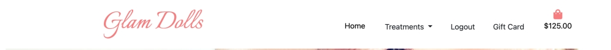

- ### Category Icons
  - The Icons serve as links to the specific categories of treatments.

 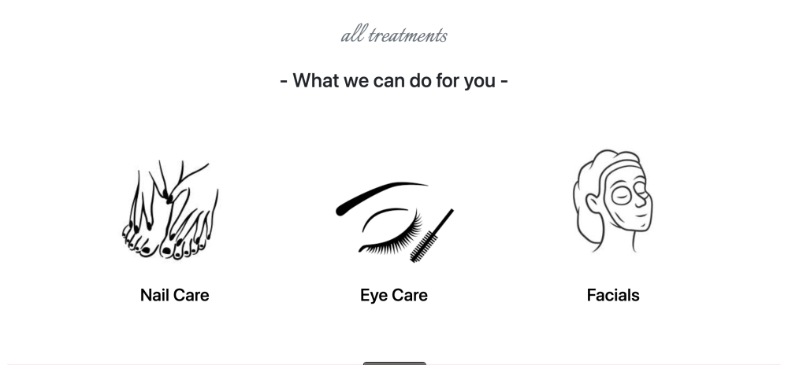

- ### Footer
  - This section includes social media links and subscription options.
  - By clicking on the Facebook icon it brings you to the GlamDoll Facebook page.
  - The subscriptions section allows you to subscribe to news to stay updated.

 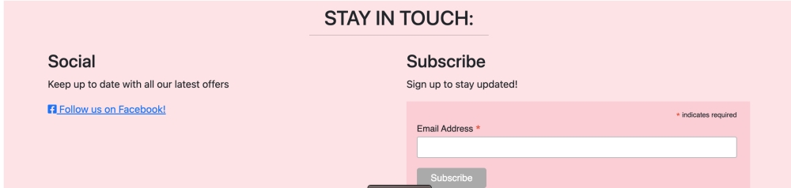

- ### All Treatments
  - The all Treatments page shows the user all the treatments offered by GlamDolls beauty salon.

 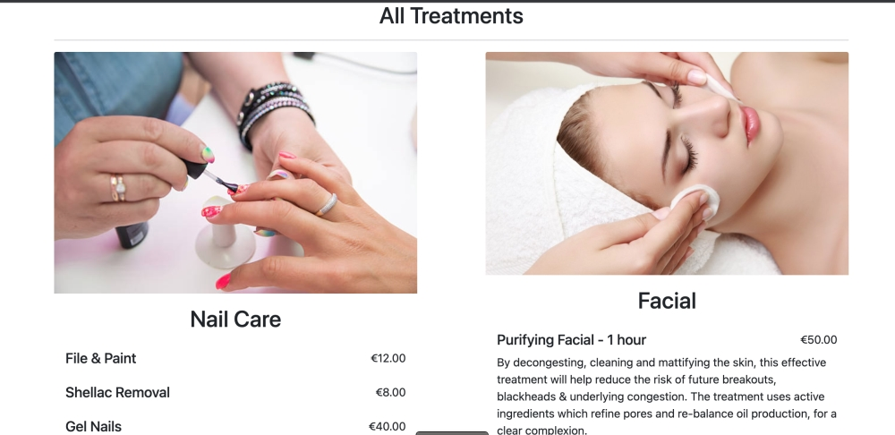

- ### Gift Card
  - The gift card page allows you to choose the type and quantity of gift cards that the user wants to purchase.

 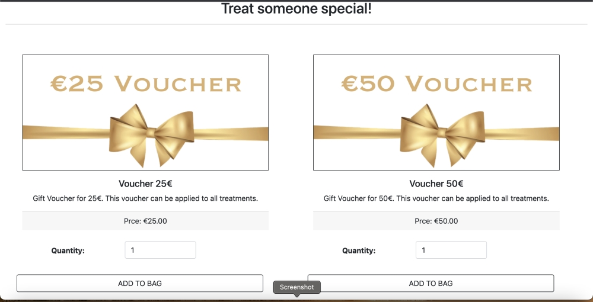

- ### Shopping Bag
  - This page allows you to purchase anything that the user has added to their bag.

 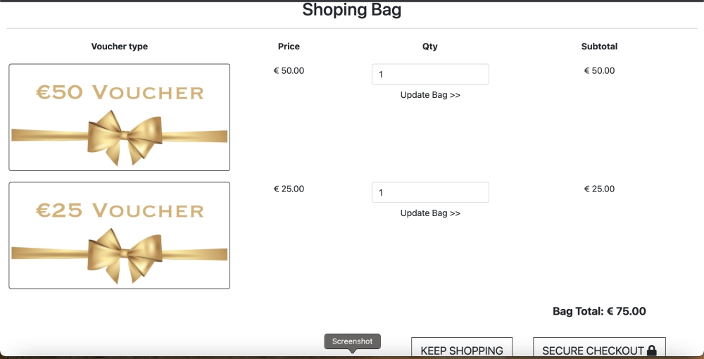

- ### FaceBook page

  [Live FaceBook page!](https://www.facebook.com/GlamDolls-105004535497850)

 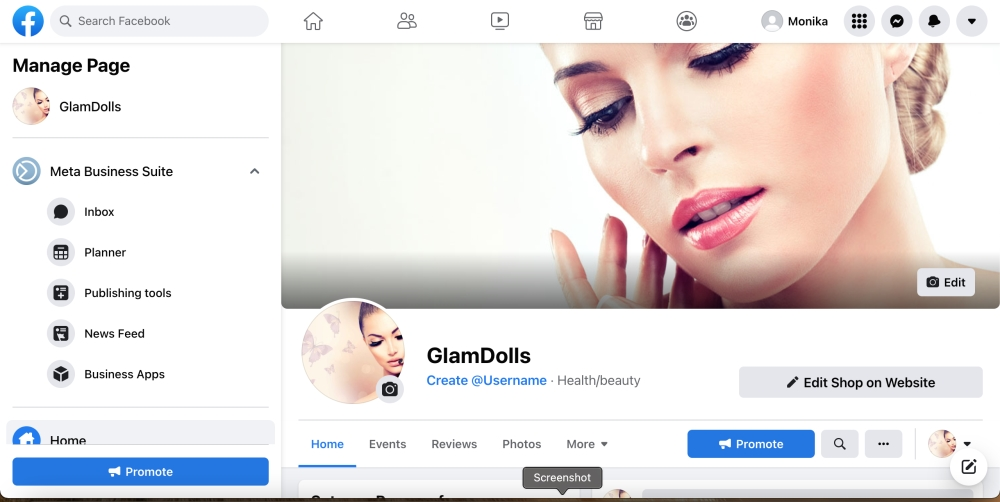

## Future Features
   - In the future, I plan to implement functionality that allows emails being sent to the user upon payment confirmation. I opted to not use Stripe webhooks for the projects, as this was not a requirement for assessment. I could have used Python to automate an email being sent, but as this is not a requirement on the assessment criteria, I have opted to leave this out for now, and plan to implement this feature later at point.

   - I plan to implement functionality that allows the user to have a personalized user profile so that they can view their personal order history and order confirmation, and see their payment information.

   - I plan to implement functionality that allows user to book their appointments online.

   - I plan to implement a Google map that allows users easily to see the salon's location.

## Technologies Used

__Balsmiq Wireframe__

 The Wireframe of this website was built in [Balsamic](https://balsamiq.cloud/)

  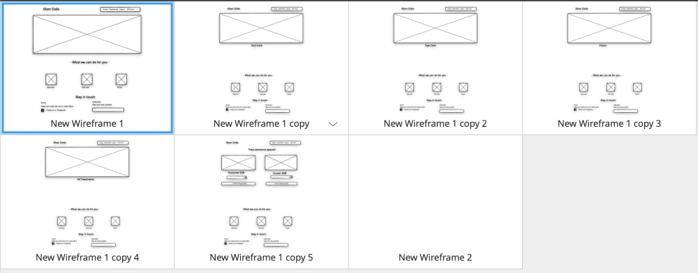

### Libraries

- For the account registration used [Django-allauth](https://django-allauth.readthedocs.io/en/latest/) library
- For the feature images and CSS support used the [Whitenoise](https://whitenoise.evans.io/en/stable/django.html)
- For the comments used [Crispy forms](https://django-crispy-forms.readthedocs.io/en/latest/) library
- For the login/logout templates used default account templates from [Allauth](https://django-allauth.readthedocs.io/en/latest/) library
- For Awesome icons used [Font Awesome](https://fontawesome.com/)

### Programming languages

- [HTML](https://www.w3schools.com/html/default.asp)
- [CSS](https://www.w3schools.com/css/default.asp)
- [Java Script](https://www.w3schools.com/js/default.asp)
- [Python](https://www.w3schools.com/python/default.asp)

### Framewoks
  - [Django](https://www.djangoproject.com/) - Django is a high-level Python Web framework that encourages rapid development and clean design.
  - [Boostrap](https://getbootstrap.com/) - Bootstrap is a web framework that focused on simplifying the development of an informative web page.

### Database
Used [SQL](https://www.w3schools.com/sql/default.asp) database by default.

 - Treatments app

| Name | Key | Type | Extra Info |
| :--------------: | :----------------: | :--------------: | :----------------: |
| Category | category | ForeignKey | null=True, blank=True, on_delete=models.SET_NULL |
| Name | name | CharField | max_length=254 |
| Description | description | TextField | null=True, blank=True |
| Price | price | DecimalField | max_digits=6, decimal_places=2 |
| Deals | deals | CharField | max_length=254, null=True, blank=True |

 - Product app

| Name | Key | Type | Extra Info |
| :--------------: | :----------------: | :--------------: | :----------------: |
| Name | name | CharField | max_length=254 |
| Description | description | TextField |  |
| Price | price | DecimalField | max_digits=6, decimal_places=2 |
| Image url | image_url | URLField | max_length=1024, null=True, blank=True |
| Image | image | ImageField | null=True, blank=True |

 - Checkout app (Order)

| Name | Key | Type | Extra Info |
| :--------------: | :----------------: | :--------------: | :----------------: |
| Order Number | order_number | CharField | max_length=32, null=False, editable=False)
| User Profile | user_profile | ForeignKey | UserProfile, on_delete=models.SET_NULL, null=True, blank=True, related_name='orders'|
| Full Name | full_name | CharField | max_length=50, null=False, blank=False |
| Email | email | EmailField | max_length=254, null=False, blank=False |
| Phone Number | phone_number | CharField | max_length=20, null=False, blank=False |
| Country | country | CharField | max_length=40, null=False, blank=False |
| Postcode | postcode | CharField | max_length=20, null=True, blank=True |
| Town Or City | town_or_city | CharField | max_length=40, null=False, blank=False |
| Street Address1 | street_address1 | CharField | max_length=80, null=False, blank=False |
| Street Address2 | street_address2 | CharField | max_length=80, null=True, blank=True |
| County | county | CharField | max_length=80, null=True, blank=True |
| Date | date | DateTimeField | auto_now_add=True |
| Order Total | order_total | DecimalField | max_digits=10, decimal_places=2, null=False, default=0 |

 - Checkout app (OrderLineItem)

| Name | Key | Type | Extra Info |
| :--------------: | :----------------: | :--------------: | :----------------: |
| Order | order | ForeignKey | null=False, blank=False, on_delete=models.CASCADE, related_name='lineitems' |
| Product | product | ForeignKey | null=False, blank=False, on_delete=models.CASCADE |
| Quantity | quantity | IntegerField | null=False, blank=False, default=0 |
| Lineitem Total | lineitem_total | DecimalField | max_digits=6, decimal_places=2, null=False, blank=False, editable=False |

 - Profile app

| Name | Key | Type | Extra Info |
| :--------------: | :----------------: | :--------------: | :----------------: |
| User | user | OneToOneField | on_delete=models.CASCADE |
| Default Phonenumber | default_phone_number | CharField | max_length=20, null=True, blank=True |
| Default Street Address1 | default_street_address1 | CharField | max_length=80, null=True, blank=True |
| Default Street Address2 | default_street_address2 | CharField | max_length=80, null=True, blank=True) |
| Default Town Or City | default_town_or_city | CharField | max_length=40, null=True, blank=True |
| Default County | default_county | CharField | max_length=80, null=True, blank=True |
| Default Ppostcode | default_postcode | CharField | max_length=40, null=True, blank=True |

## Testing

 ### Validator Testing
  - HTML code is validated throught [W3 validatdor](https://validator.w3.org/).
     Result came out as follows.

    - Home page
  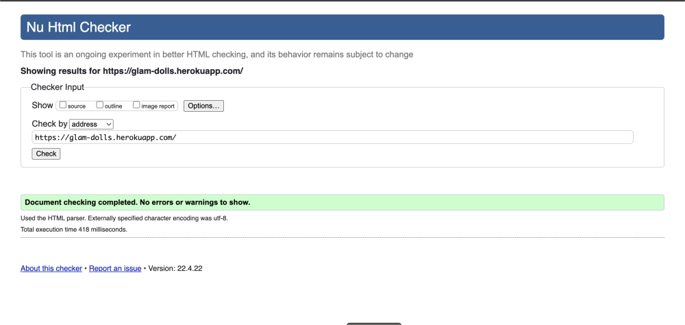

    - Eye Care page
  

    - Naile Care page
  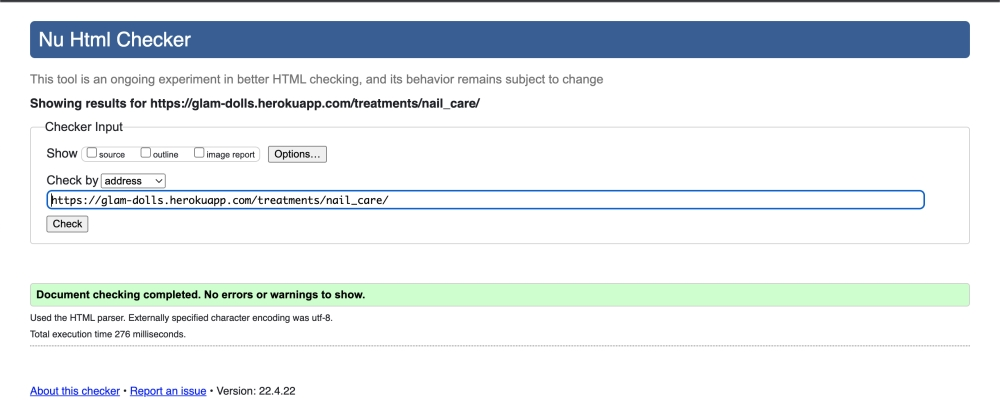

    - Facial page
  

    - Product page
  

    - Bag page
  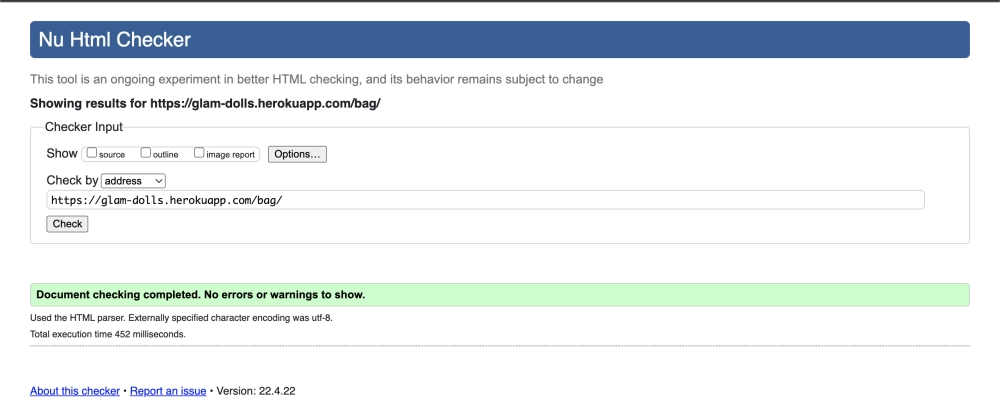

    - Login page
  

    - Logout page
  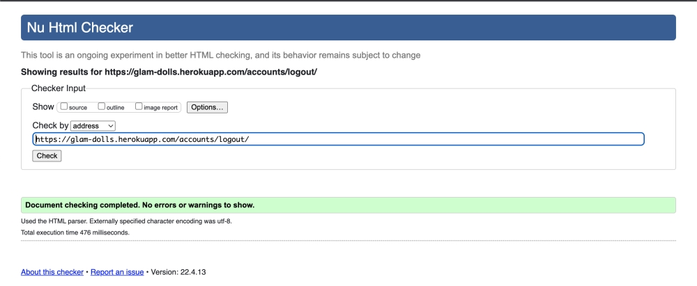

  - CSS code is validated throught [W3 Jigsaw](https://jigsaw.w3.org/css-validator/)

  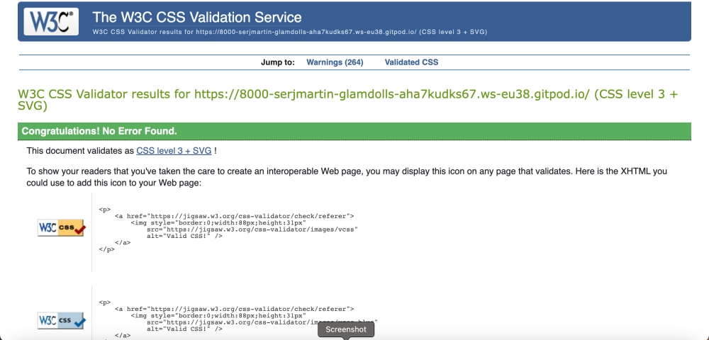

  - JavaScript code is validated throught [JS Hint](https://jshint.com/)

  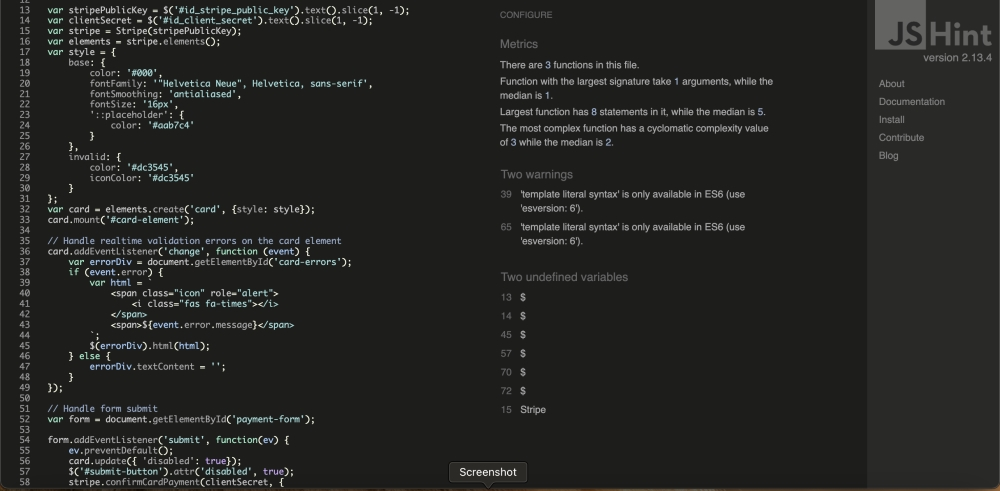

  - Python code is validated throught [PEP8](http://pep8online.com/)

  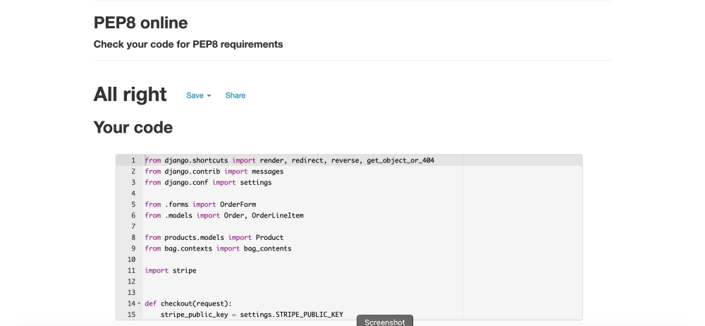
  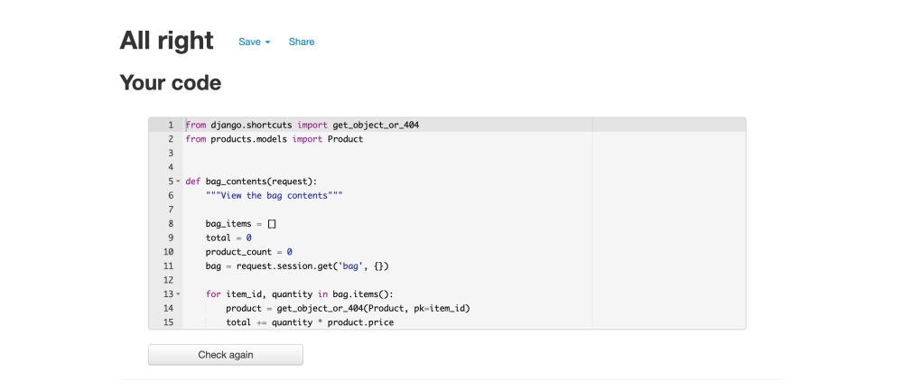
  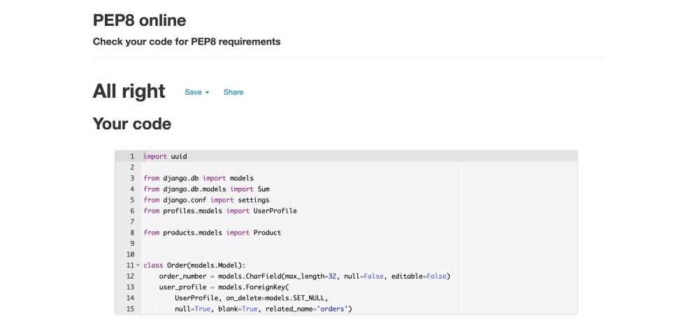
  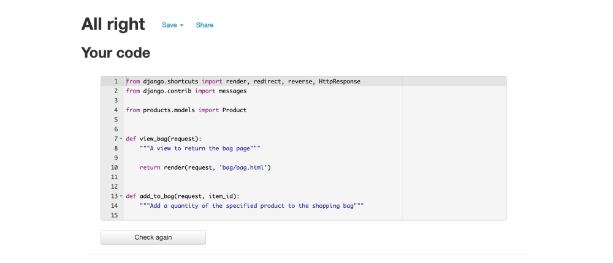
  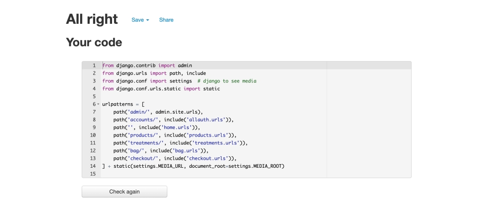
  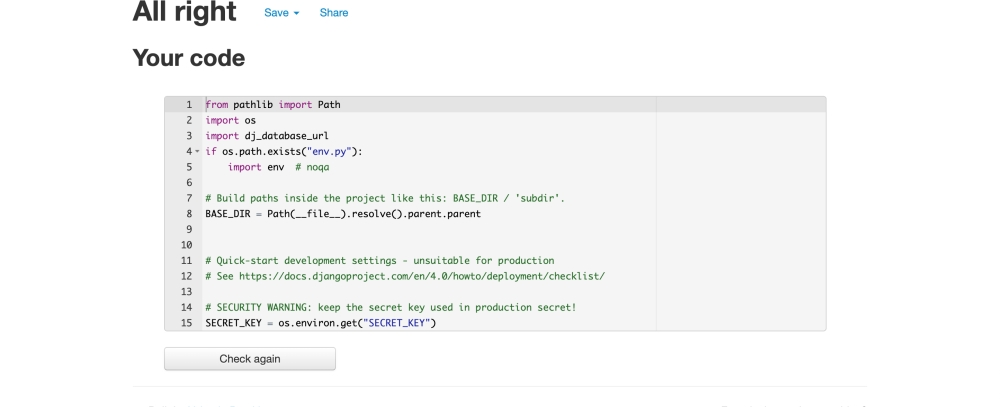

 ### User Story Testing

  - As **Site User** I want to be able to **easily register for an account** so that I can **have a personal account and be able to view my profile**
  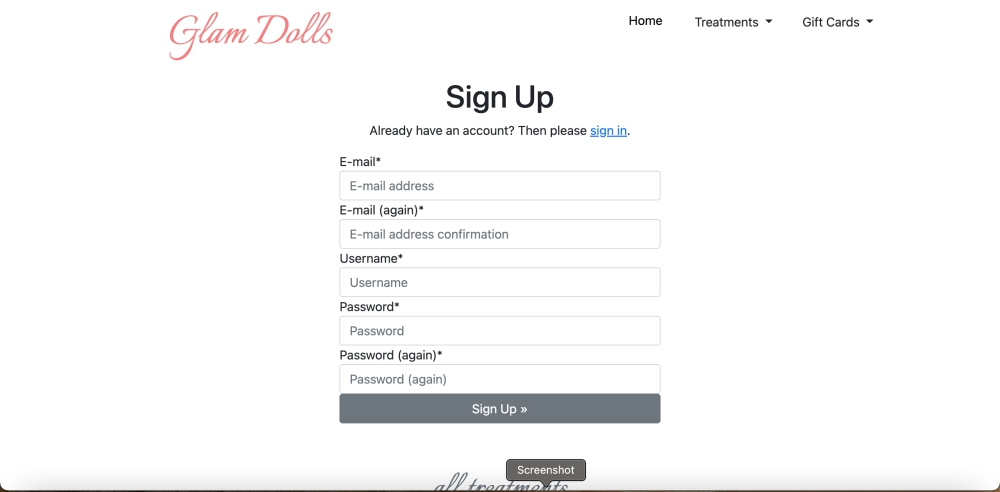

  - As **Site User** I want to be able to **easily login or logout** so that I can **access my personal account information**
  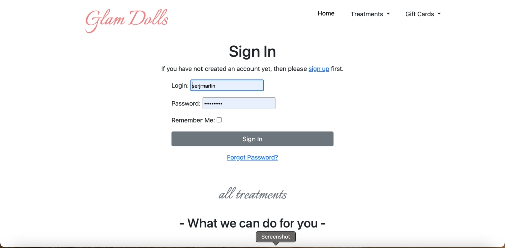

  - As **Site User** I want to be able to **easily recover my password in case I forget it** so that I can **recovery access to my account**
  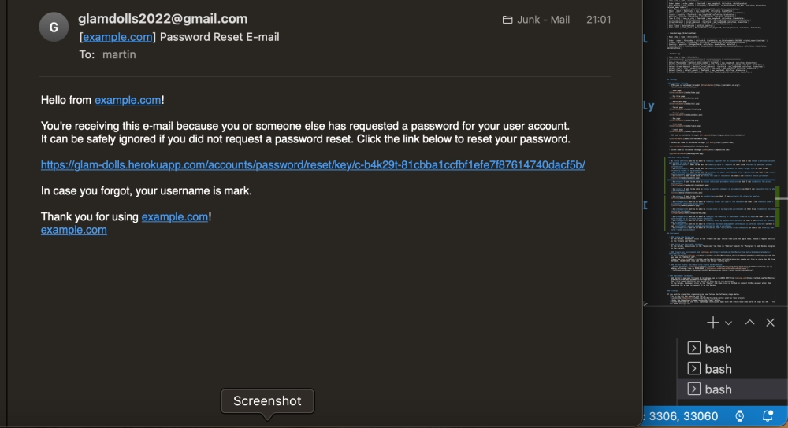

  - As **Site User** I want to be able to **receive an email confirmation after registering** so that I can **verify that my account registration was successful**
  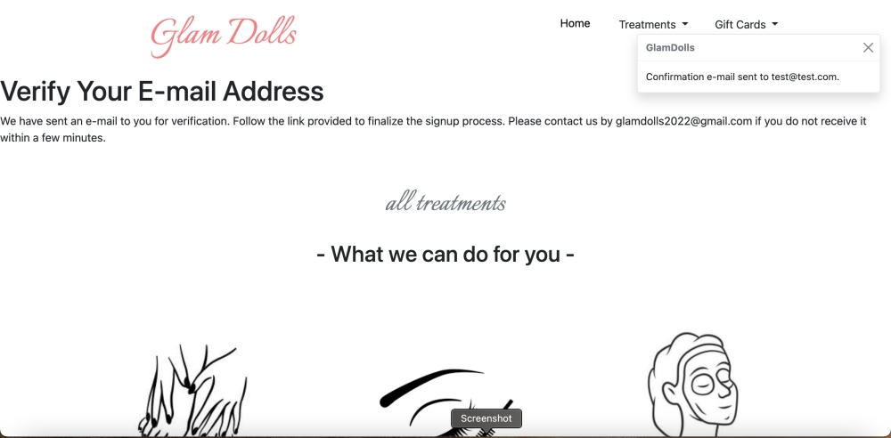

  - As **User** I want to be able to **view the type of vouchers** so that I can **select one to purchase**
  

  - As **User** I want to be able to **view individual procedure details** so that I can **identify the price, description**
  

  - As **User** I want to be able to **view a specific category of procedure** so that I can **quickly find in what I am interested in**
  

  - As **User** I want to be able to **subscribe** so that  I can **receive the offers by email**
  

  - As **Shopper** I want to be able to **easily select the type of the voucher** so that I can **ensure I don't accidentally select the wrong one**
  

  - As **Shopper** I want to be able to **view items in my bag to be purchased** so that I can **identify the total cost of my purchase**
  

  - As **Shopper** I want to be able to **adjust the quantity of individual items in my bag** so that I can **easily make changes to my purchase before checkout**
  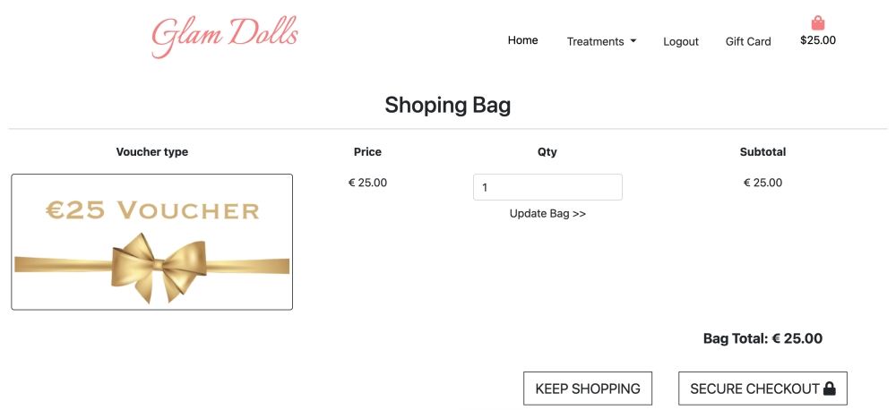

  - As **Shopper** I want to be able to **easily enter my payment information** so that I can **check out quickly and no hassles**
  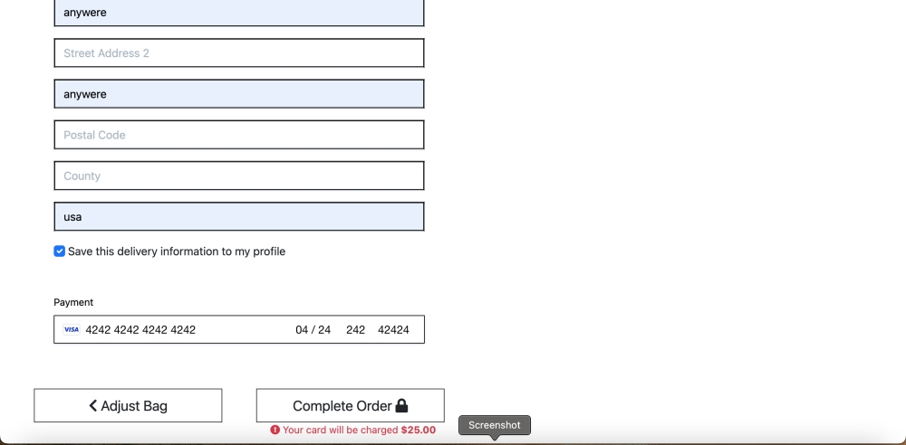

  - As **Shopper** I want to be able to **feel my personal and payment information is safe and secure** so that I can **confidently provide needed information to make a purchase**
  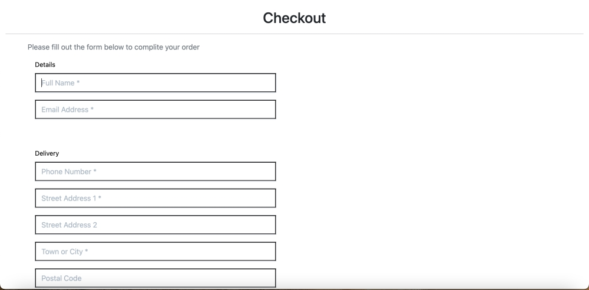

  - As **Shopper** I want to be able to **view an order confirmation after checkout** so that I can **verify that I haven't made any mistake**
  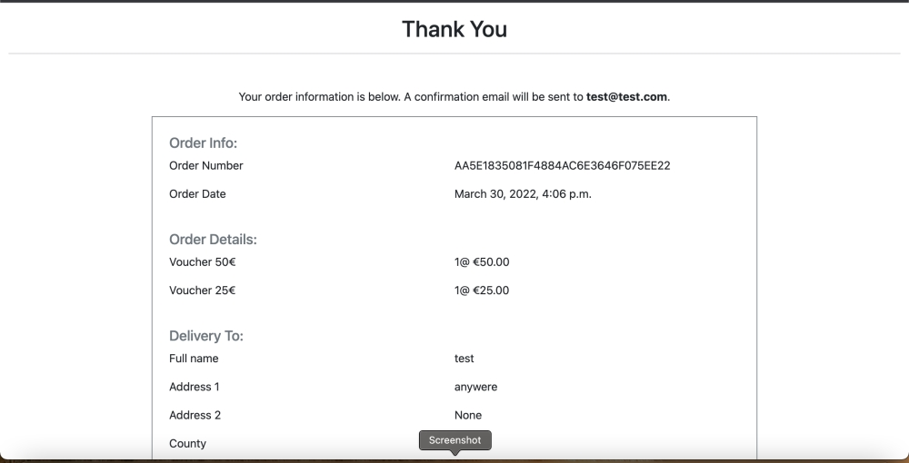

## Deployment

  - ### Create the Heroku app
    On the Heroku, dashboard click on the "Create new app" button then give the app a name, choose a region and click on the "Create app" button.

  - ### Attach the PostgreSQL database
    On the Heroku, menu clicks on the "Resources" tab then in "Add-ons" search for "Postgres" to add Heroku Postgres to the project.

  - ### Prepare our environment and [settings.py](https://github.com/SerjMartin/glam_dolls/blob/main/glamdolls/settings.py) files
    In the project's [settings.py](https://github.com/SerjMartin/glam_dolls/blob/main/glamdolls/settings.py) add the app name in "INSTALET_APP".
    Create the [env.py](https://github.com/SerjMartin/glam_dolls/blob/main/env_sample.py) file to store the URL from DATABASE, SECRET_KEYS then add them in the Heroku "Config Vars".

  - ### Get our static and media files stored on Whitenoise
    - In the project's [settings.py](https://github.com/SerjMartin/glam_dolls/blob/main/glamdolls/settings.py) by adding followings line in MIDDLEWARE ["whitenoise.middleware.WhiteNoiseMiddleware"]
    - In Gitpod workspace's terminal install Whitenoise by typing ("pip3 install whitenoise")

 - ### Deployment to Heroku
    Add Heroku's app name followed by herokuapp.com to ALLOWED_HOST from [setings.py](https://github.com/SerjMartin/glam_dolls/blob/main/glamdolls/settings.py).
    Add a file named "Procfile" for Heroku to know how to run my project.
    In the Heroku, dashboard click on the "Deploy" tab then click on GitHub to connect GitHub account after that searching for a repo to connect it to the Heroku.

### Cloning

If you wish to clone this repository you can follow the following steps below.
   - Go to the Git Hub website and log in.
   - Locate the [Repository](ithub.com/SerjMartin/glam_dolls) used for this project.
   - Under the Repository's name locate the "Code" button.
   - Either Download the ZIP file, unpackage locally and open with IDE (This route ends here) OR Copy Git URL    from the HTTPS dialogue box.
   - Open your developement editor of choice and open a terminal window in a directory of your choice.
   - Use the git clone command in terminal followed by the copied git URL.
   - A clone of the project will be created locally on your machine.
Once the project has been loaded into an IDE of choice, run the following command in the shell to install all the required packages: pip install -r requirements.txt.

## Acknowledgement

  - Thank you to everyone who took their time to provide me with constructive feedback on the Slack community app.
  - Big thanks to my mentor 'Tim Nelson' for his time to answer all my questions and his professional advice.